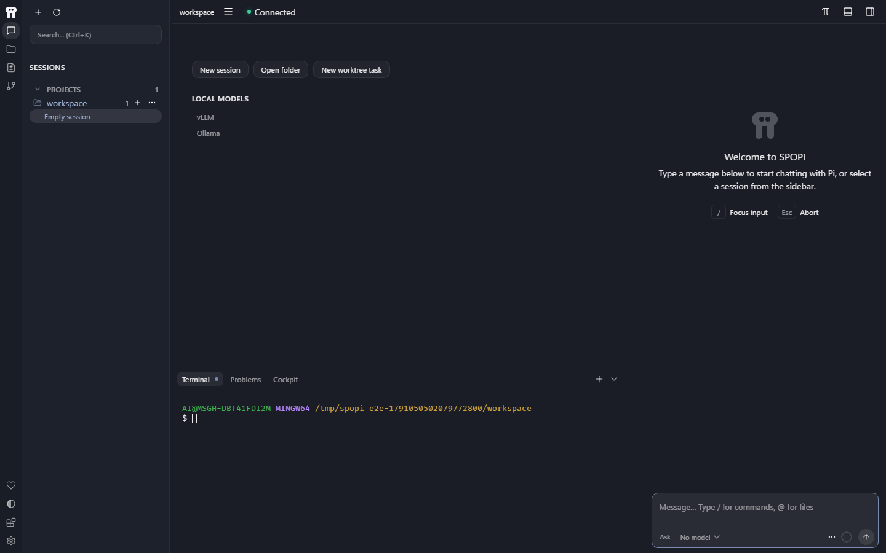
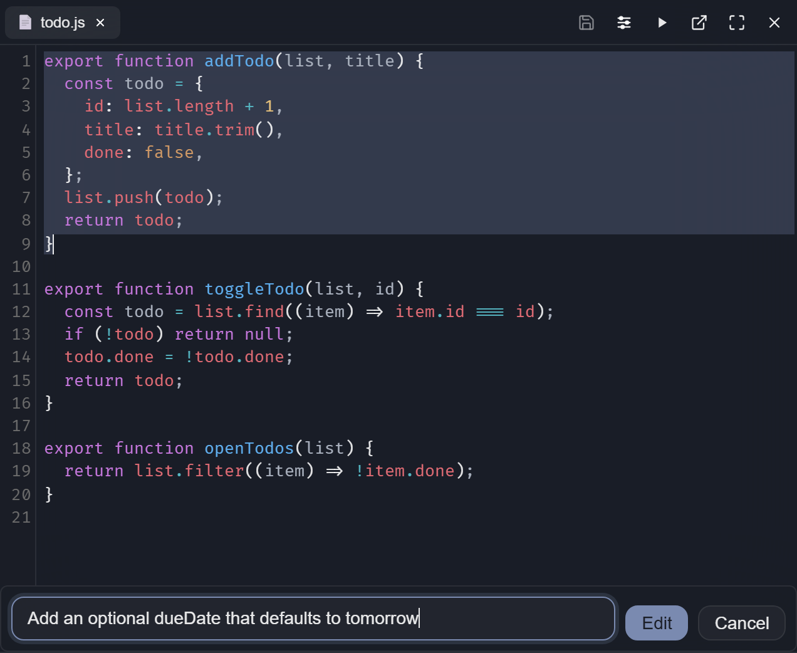
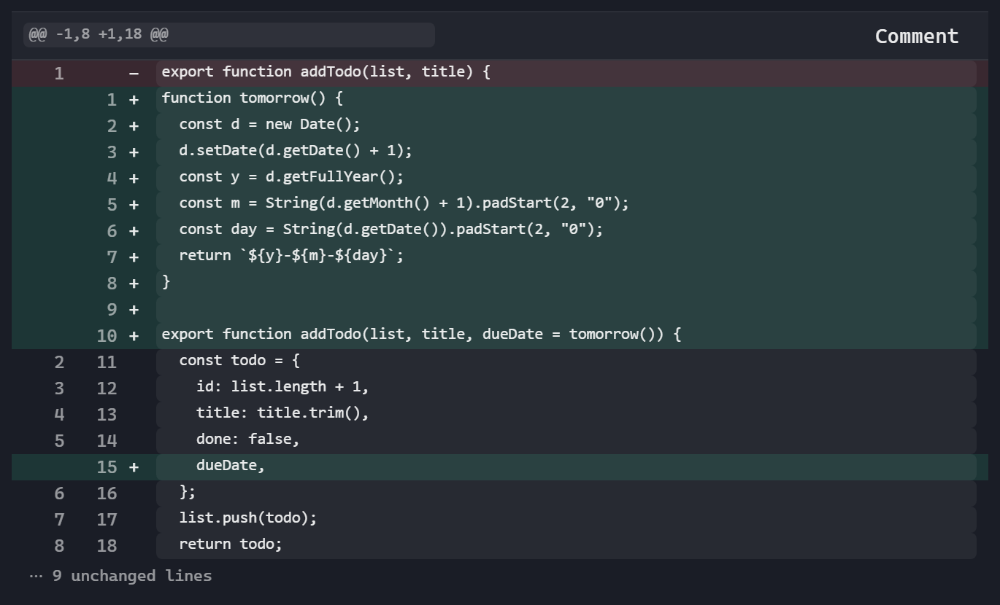
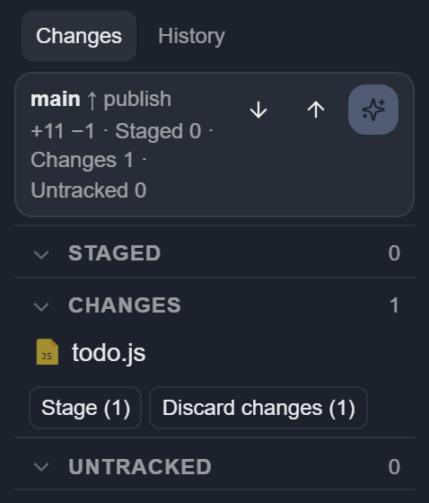
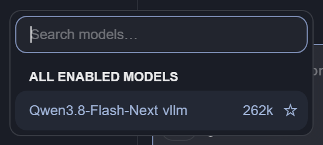
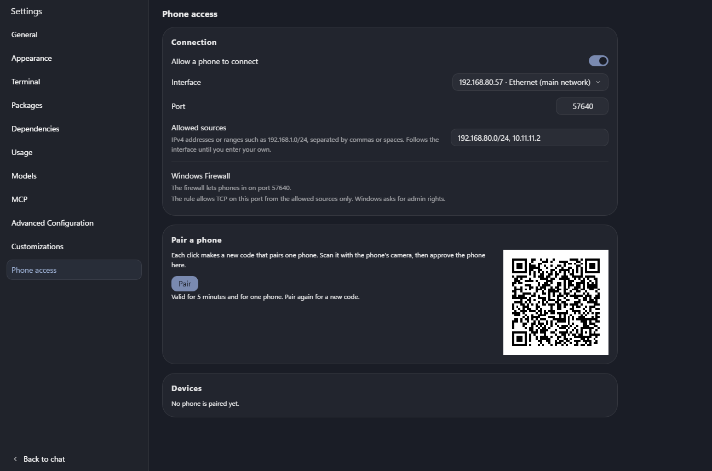
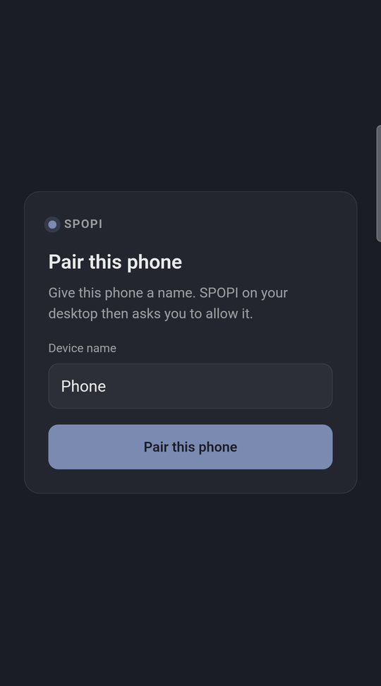
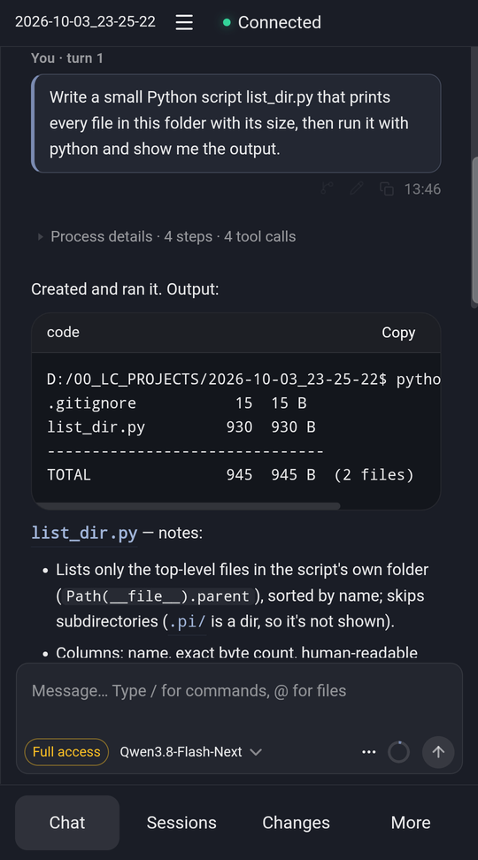

# SPOPI

**Pi, with a UI and editor. Nothing hidden, simple, clean and in PI's spirit.**

An editor Pi can change while you use it.

https://github.com/user-attachments/assets/dc23677b-3ea7-45e0-aaeb-d356e6d327e7

*There is no pink. The video is Pi adding some.*



*The default interface.*

SPOPI is a free, open-source desktop app for the [Pi](https://pi.dev) coding agent. Your code sits in the middle, Pi's chat runs down the right, and a terminal and Git sit under the code.

It shares your Pi setup: the same settings, packages, and sessions in `~/.pi/agent`. Close the window, type `pi -r` in a terminal, and carry on with the same chat. There is no account and no telemetry. With a local model, your code and prompts never leave your machine. 

**[Download](https://github.com/spongioblast/spopi/releases)** · [Every feature](./docs/FEATURES.md) · MIT · about 55 MB on Windows, Pi included

**SPOPI is alpha.** It works well for real projects, and it is still evolving: expect rough edges, and expect things to move between releases. Built and tested on Windows. The macOS and Linux installers come from the same build. If you run one, [tell us how it went](https://github.com/spongioblast/spopi/issues).

## What you get

- **Any model.** Anthropic, OpenAI, a ChatGPT sign-in, or any OpenAI-compatible server. vLLM, Ollama, and LM Studio get real support, not just a URL box.
- **Every step in view.** Each tool call, each file touched, and what each turn cost.
- **A diff for every turn.** Review what changed, comment on it, and undo the last turn.
- **Edits in place.** Select code, press Ctrl+K, and Pi rewrites just that part.
- **A self-check.** If Pi breaks a file it just edited, it gets the error and fixes it before the turn ends.
- **No waiting.** Steer Pi mid-turn, queue the next message, fork from any point, or retry with another model.
- **Your phone, if you want it.** Off by default, over your own network or WireGuard etc.

## No telemetry, no business model behind it

"Nothing hidden" goes for SPOPI itself, not only for [what Pi does](#nothing-hidden).

- **What SPOPI is.** MIT-licensed source on GitHub. The interface is plain HTML, CSS, and JavaScript files on your disk that you can open and read.
- **No telemetry, no tracking, no account.** No usage data, crash reports, or analytics go anywhere. SPOPI's own requests are the update check against this repository's GitHub releases (at start and every six hours) and, on the Packages page, the public package list and an npm or Git check for newer versions of the packages you installed. None of them carries your code, your prompts, or an ID. Everything else goes only where you point it: your model provider, or nowhere with a local model.
- **No business model behind it.** No paid tier, no investors, nothing to upsell, and so no reason to collect anything about you.

## It checks its own work

After a turn that edits files, SPOPI runs your project's check: `tsc`, `cargo check`, `go vet`, or the `check` script in `package.json`. A failure in a file Pi just changed goes back to Pi, and Pi fixes it before the turn ends. If Pi cannot fix it, you are told.

Pi can also open what it built. [agent-browser](https://github.com/vercel-labs/agent-browser) comes with SPOPI, so Pi can click through your local app and read screenshots. It needs Chrome, which Settings → Dependencies can download. `/skill:verify-recipe` saves how your project is built, tested, and started, so Pi knows next time.

## Nothing hidden

- **The turn stays readable.** Thinking and tool calls fold into one "Worked for …" row that counts files read, commands run, and files edited. The answer stays in view. Open the row to see every step.
- **You set the permissions.** **Ask** checks before each command or edit. **Auto-edit** edits freely and asks before shell commands. **Full access** tells you once and stops asking. Requests show above the chat box, not in pop-ups. A project's own Pi extensions and check command run only after you trust it, so a cloned repository cannot start code on open. This is not a sandbox: Pi runs with your user's rights, and Settings lists ways to run it in a container.
- **Long output stays out of the prompt.** A 10,000-line build log is saved to a file, and Pi gets the path plus the first and last lines. You still see all of it.

When a turn finishes and the window is in the background, you get a desktop notification.

## Pi's way, not a new one

- **Plans are files.** There is no plan mode. Ask Pi to write the plan in Markdown, edit it, then have Pi work through it.
- **Packages just work.** Install them from Settings → Packages. A package's dialogs, panels, and slash commands appear in SPOPI as they do in the terminal. The recommended ones add per-turn undo (`pi-workspace-history`), live diagnostics (`pi-lens`), subagents (`pi-subagents`), and worktree commands (`@pify/worktree`).
- **MCP is Pi's.** Settings → MCP adds and lists servers through Pi. The π button opens Pi in a terminal tab for anything only Pi's own interface does, such as switching servers on and off. Quit it and SPOPI picks up the changes.
- **Your setup is plain files.** Keys, models, prompts, and `AGENTS.md` can be edited in Settings, and they are the files the terminal reads.

## Ask Pi to change the UI

With Pi you don't wait for a feature. You ask Pi to add what you need: a command, a tool, an extension. SPOPI's interface works the same way. It is plain files, not a bundle packed into the installer, so you can ask Pi in the chat for another theme, a wider chat, other wording, or a new button, and the window changes while you watch. That is the video above. On Windows, Pi can take a screenshot of the window to see what it is changing.

Your changes live in their own folder, so updates keep them. If an update touches a file you changed, SPOPI shows both versions and you merge them.

**Safe mode** serves the shipped interface only. Your overlay files stay on disk; they are just not used. Turn it on in Settings → Customizations → **Use the shipped interface only**. If a change broke the window so Settings will not open, start SPOPI with `--safe`: on Windows, `spopi.exe --safe` from the install folder, or add `--safe` to the shortcut's Target. That start ignores the overlay. The next normal start uses your overlay again unless you left the Settings toggle on. After two starts that never finish loading, SPOPI turns safe mode on by itself.

It comes with six themes (Dawn, Dusk, Midnight, Clean, Terracotta, and Sage; still no pink, unless you ask) and six languages (English, German, Spanish, Italian, Japanese, and Chinese).

This is why SPOPI is a small [Tauri](https://v2.tauri.app/) app, not Electron. Rust handles the window, files, Git, and the terminal. The interface runs in the webview your system already has: WebView2 on Windows, WKWebView on macOS, WebKitGTK on Linux. Pi runs as its own program, `pi --mode rpc`, not as code built into the app. SPOPI ships the Pi version it was tested with and always uses that one, so updating the Pi on your PATH cannot break it.

## Work in the file, not the chat

Select some code and two buttons appear under it.

**Edit** (Ctrl+K, Cmd+K on a Mac) takes one sentence and rewrites the selection. It is a normal edit: the file is saved, Ctrl+Z undoes it, and Git shows it. There is no accept step. **Ask Pi** (Ctrl+L) puts a pointer such as `@src/todo.js:1-9` in the chat, so you ask about those lines without pasting them. Type `@` to point at any other file.



The editor, file search, and previews for Markdown, HTML, images, PDF, and Office files are in the same window, next to a real terminal: Git Bash, PowerShell, or your usual shell.

## Every turn has a diff

When Pi changes files, the turn ends with "Changed 3 files · Review". Review shows that turn or the whole session. Press `c` on a change to leave a comment, collect a few, and send them to Pi as one review. **Undo last turn** puts everything back. Per-turn review and undo come from the recommended `pi-workspace-history` package.



The Git panel covers the rest: stage, discard, commit (Pi can write the message), pull, push, and history. Its diffs open in the same view as Review. A Git worktree shows up as its own project in the sidebar, and **New worktree** makes one for a side task.



## Local models, measured

With nothing open, the home screen lists the vLLM, Ollama, and LM Studio servers running on this machine. Paste any other address and SPOPI detects the server type and the context size. **Set up model** then sends a few short test requests to learn whether the model thinks, how its thinking is switched on and off, and whether it takes images. The Think button only offers what your server accepts.



Switch models in the middle of a session, or ask the same question again with another model from any point in the chat.

**Cockpit** (`/cockpit`) shows each prompt's tokens, speed, cache hits, and time. On vLLM it adds KV cache, time to first token, queue, and prefill, which is what you watch when you tune a model on your own GPU. Settings → Usage tracks spending on cloud models.

## From your phone

Turn on Phone access, scan the code, and follow or steer a session from your phone on the same network or over Tailscale. HTTPS only, each pairing code works once, and you decide whether a phone may watch, control, or do everything. On Windows, one button lets the phone through the firewall. It is assumed you use OpenVPN or Wireguard to tunnel into your network. Don't expose your port outside of your network.



Full control of SPOPI from the phone.

<p>

&nbsp;&nbsp;&nbsp;&nbsp;&nbsp;&nbsp;

</p>

## What it doesn't do, and whats to come

SPOPI is not a second agent: planning, tools, compaction, subagents, and MCP are Pi and its packages. No autocomplete as you type, and no codebase index yet. Next is better phone support for settings, potentially code review etc. Also want to further simplify it, reduce it as PI seems to rapidly expand it's core. What do you think should be next? 

## Install

From [Releases](https://github.com/spongioblast/spopi/releases):

- Windows: `SPOPI_*_win_x64-setup.exe` (most PCs) or `SPOPI_*_win_arm64-setup.exe` (ARM laptops)
- macOS: `SPOPI_*_mac_arm64.dmg` (Apple Silicon) or `SPOPI_*_mac_x64.dmg` (Intel), untested
- Linux: `SPOPI_*_linux_x64.AppImage` or `SPOPI_*_linux_arm64.AppImage`, untested

Pi and the browser tool are included, so you don't install Pi yourself. The installers are not code-signed yet:

- **Windows:** SmartScreen may warn you. Click **More info**, then **Run anyway**.
- **macOS:** Gatekeeper may block the first start. Go to System Settings → Privacy & Security and click **Open Anyway**.

SPOPI updates itself from Settings → General. On first start, a short note walks you through the projects folder, a model, Settings → Dependencies, and the recommended packages. If you already use Pi, your models and sessions are already there.

### What else you need

Settings → Dependencies shows what is missing on your machine, can install Node.js and Chrome for you, and **Test all** checks everything again. On Windows:

| What | For | Install |
| --- | --- | --- |
| [Git for Windows](https://git-scm.com/download/win) | **Required.** Pi runs its commands in Git Bash, and the Git panel uses Git. | `winget install --id Git.Git -e` |
| WebView2 | **Required.** The window. Windows 11 has it; on Windows 10 the installer fetches it. | Nothing to do |
| [Node.js](https://nodejs.org) LTS | **Recommended.** Installing Pi packages, including the recommended ones. | `winget install OpenJS.NodeJS.LTS`, or Settings → Dependencies |
| Chrome | **Recommended.** Pi opening the app it built. An installed Chrome or Brave works; Edge is not used. | **Download browser** in Settings → Dependencies |
| [ripgrep](https://github.com/BurntSushi/ripgrep) | Optional. Faster file search. | `winget install BurntSushi.ripgrep.MSVC` |
| Python 3.10+ and MarkItDown | Optional. Word, PowerPoint, and Excel previews. | `winget install Python.Python.3.12`, then `py -m pip install "markitdown[all]"` |

Restart SPOPI after installing Git or Node.js so it picks up the new `PATH`.

On macOS and Linux (untested), Git and a shell are usually there already. Install Node.js from your package manager or [nodejs.org](https://nodejs.org). Settings → Dependencies shows the commands for your system.

## Build from source

You need Rust, Bun, and Node 22 or newer, plus the [Tauri prerequisites](https://v2.tauri.app/start/prerequisites/). On Windows, a few scripts use Git Bash, and Rust needs the Microsoft C++ Build Tools:

```powershell
winget install --id Git.Git -e
winget install Rustlang.Rustup Oven-sh.Bun OpenJS.NodeJS.LTS
winget install Microsoft.VisualStudio.2022.BuildTools --override "--wait --passive --add Microsoft.VisualStudio.Workload.VCTools --includeRecommended"
```

Then:

```bash
bun install --frozen-lockfile
bun run fetch:pi
bun run dev
```

`bun run build` makes an installer for the system you are on.

## Docs

- [docs/FEATURES.md](./docs/FEATURES.md): every feature, how to set it up or turn it off, and its limits
- [ARCHITECTURE.md](./ARCHITECTURE.md): the transport, the host, the security boundary, and the rules the code keeps
- [AGENTS.md](./AGENTS.md): how to change the code, for you or for Pi
- [docs/DESIGN.md](./docs/DESIGN.md): the design system: tokens, UI primitives, and how Settings pages are built
- [CHANGELOG.md](./CHANGELOG.md): what each release added and fixed
- [docs/PI_BUMP.md](./docs/PI_BUMP.md): how to update the Pi that ships inside SPOPI

## License

MIT. See [LICENSE](./LICENSE).

## Thanks

SPOPI is built on much of the early work of [Tau](https://github.com/deflating/tau) and [Picot](https://github.com/shixin-guo/picot). And of course the key is [Pi](https://github.com/earendil-works/pi). Thank you!
